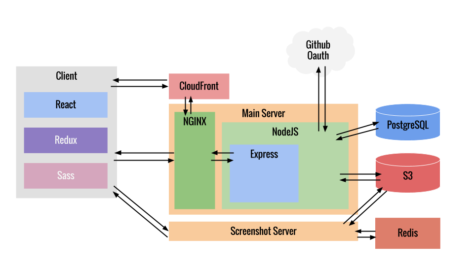

# frolicking tuba

API integrating with github allowing users to easily annotate a website.

## Installation

dependencies before install

* postgresql
* redis
* npm
* node
* gulp installed globaly (for easier building)

assuming you have everything setup

* run `npm install` to get all the neccessary packages
* edit `env/config.js` depending on your environment
* run `npm run build`

you can now run the application using `npm start`

## Architecture

The screenshot server is available at [turbio/docshot](https://github.com/turbio/docshot)
